

<picture>
  <source media="(prefers-color-scheme: dark)" srcset="media/logo/majlis-logo-on-dark.png">
  <source media="(prefers-color-scheme: light)" srcset="media/logo/majlis-logo-on-light.png">
  
</picture>

### Your table. Your people. · طاولتك. ناسك.

**An Arabic-first social card game platform for iOS and Android.**
Sit down with friends, family or new players for Tarneeb, Trix and 400 (أربعمية),
online or offline, on a table that feels like the real thing.

[-F38020?style=for-the-badge&logo=sqlite&logoColor=white)](#architecture)

[Website](https://majlis-game.com) · [Features](#features) · [Architecture](#architecture) · [Engineering highlights](#engineering-highlights) · [About the developer](#about-the-developer)

---

> **Source code is private; this repository is a showcase.** It holds screenshots,
> short clips and an overview of how Majlis is built. No application code lives here.

## In motion

<table>
  <tr>
    <td align="center">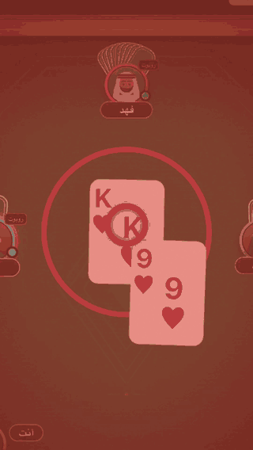 The King of Hearts moment</td>
    <td align="center"> A whole round, sped up</td>
  </tr>
  <tr>
    <td align="center">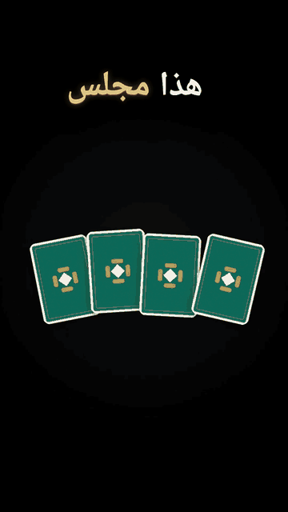 App tour</td>
    <td align="center">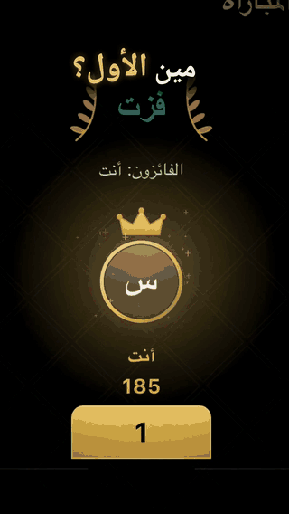 Last cards and the podium</td>
  </tr>
</table>

Full-quality vertical clips: <a href="media/video/app-tour.mp4">app tour (mp4)</a> · <a href="media/video/king-of-hearts.mp4">King of Hearts (mp4)</a>

## Screenshots

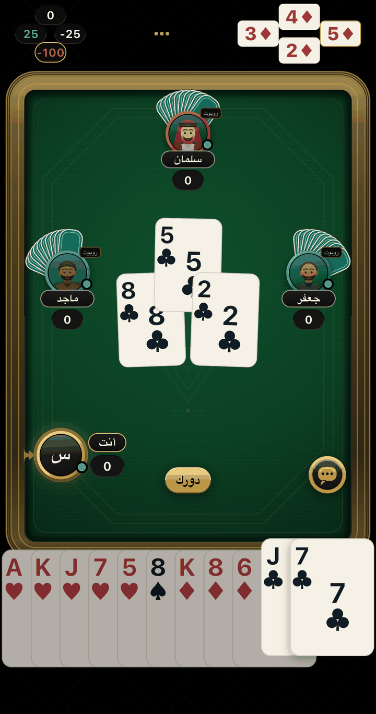&nbsp;
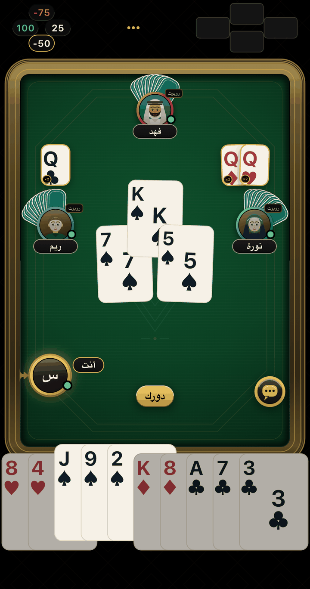&nbsp;
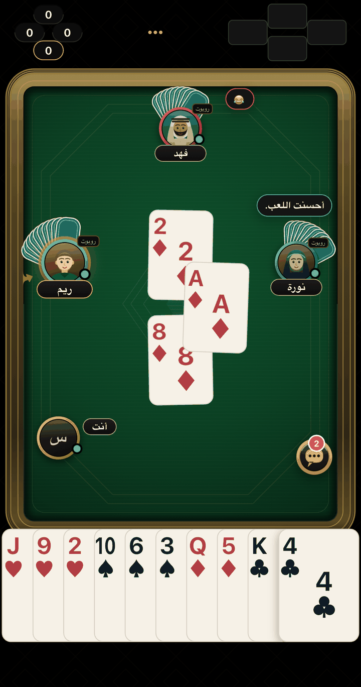&nbsp;
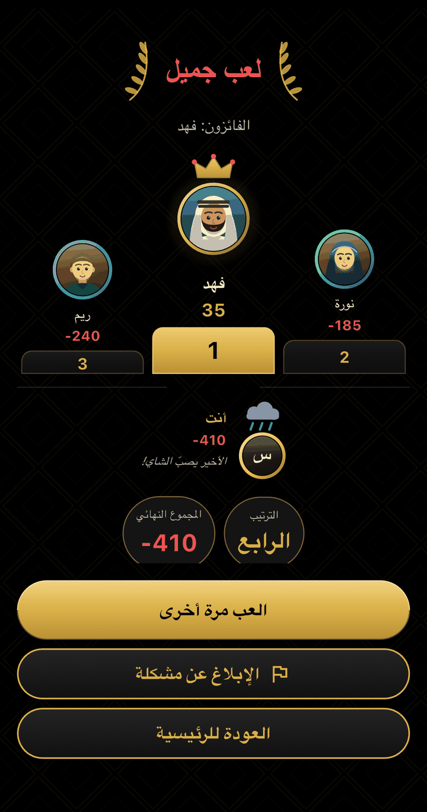

<b>App tour, one screen at a time</b>

 

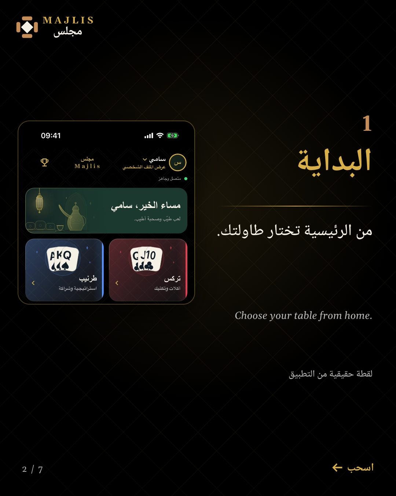
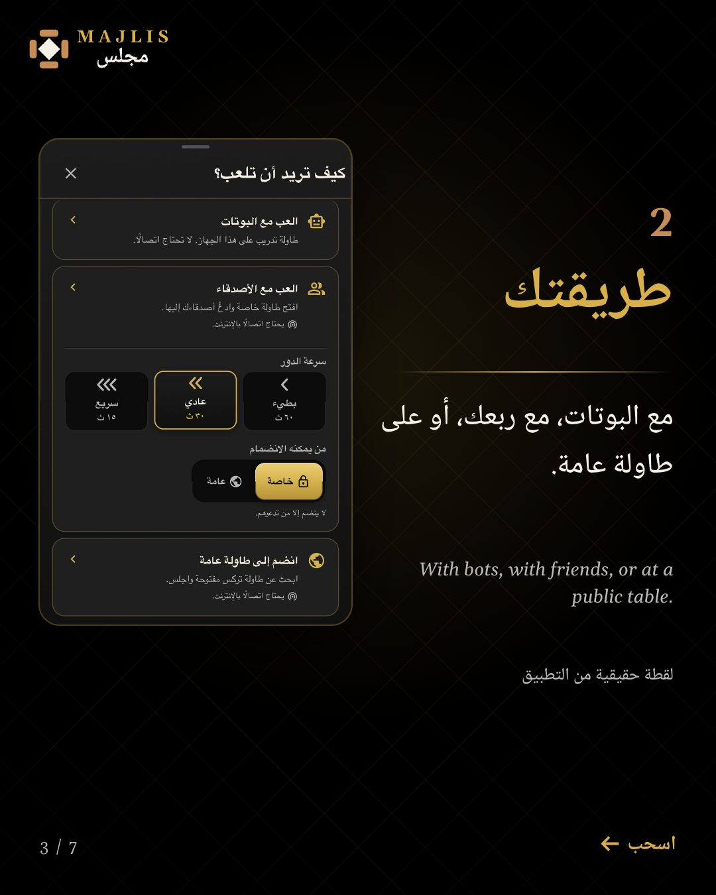
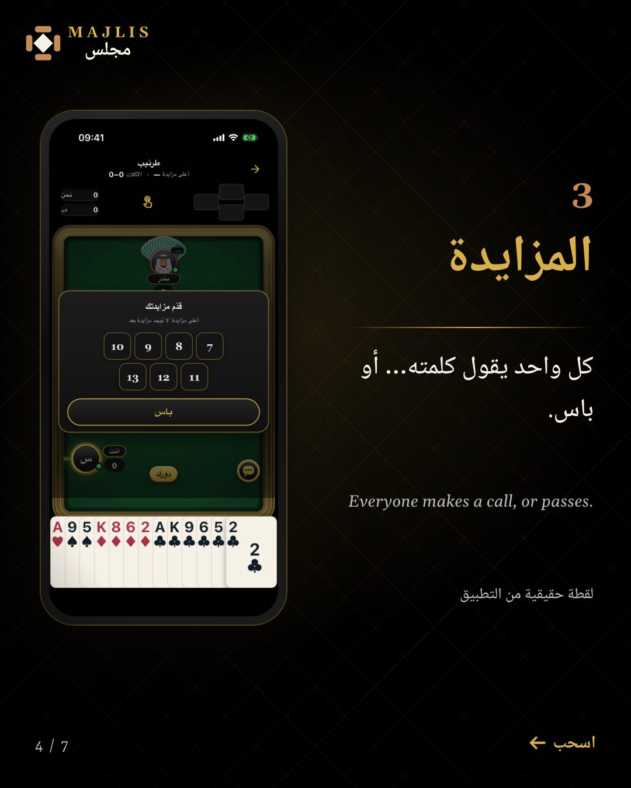
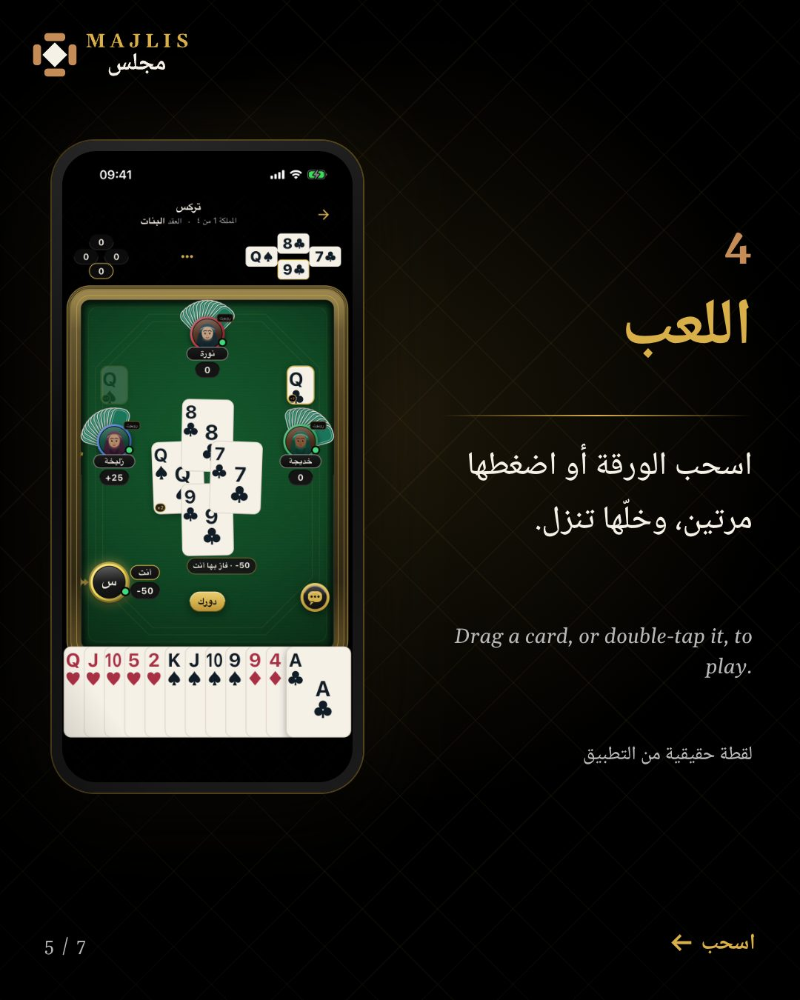
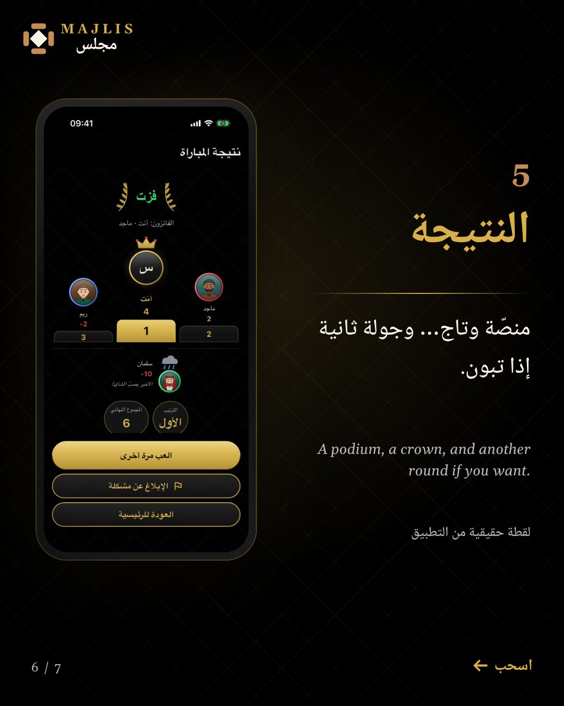
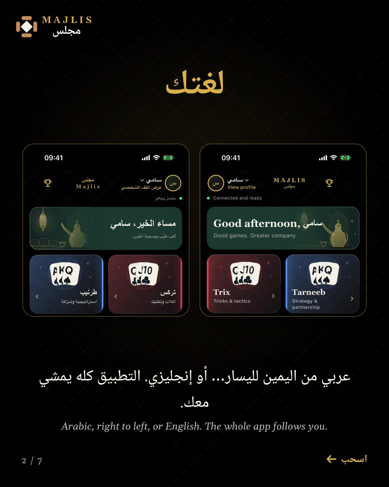
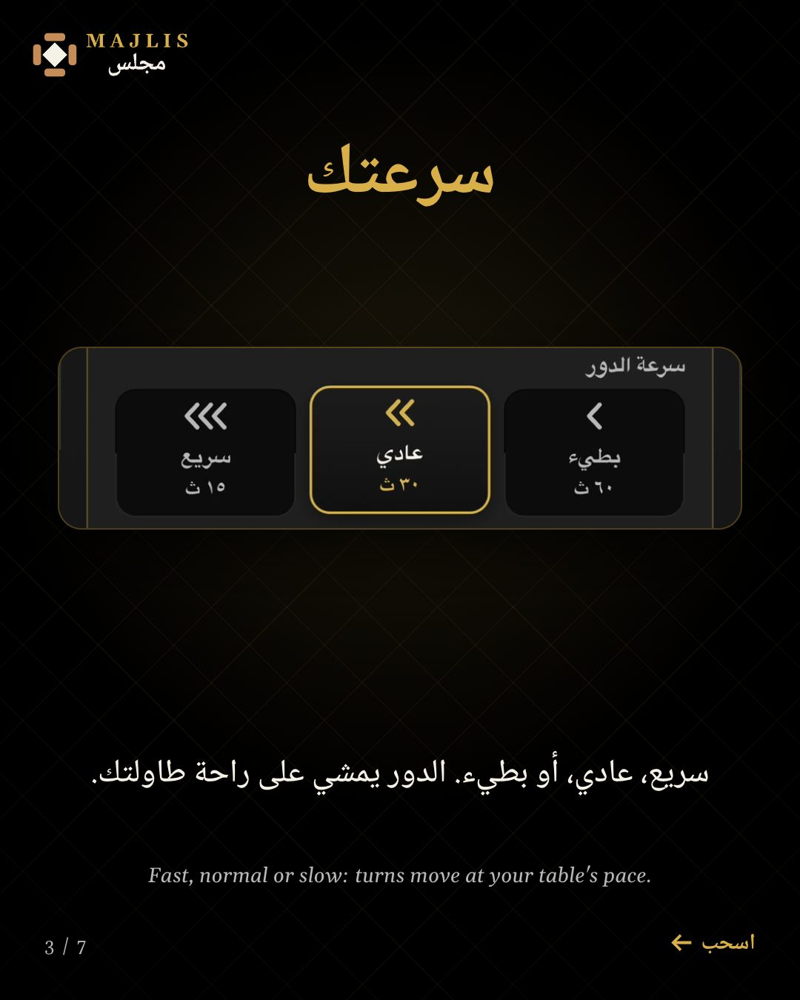
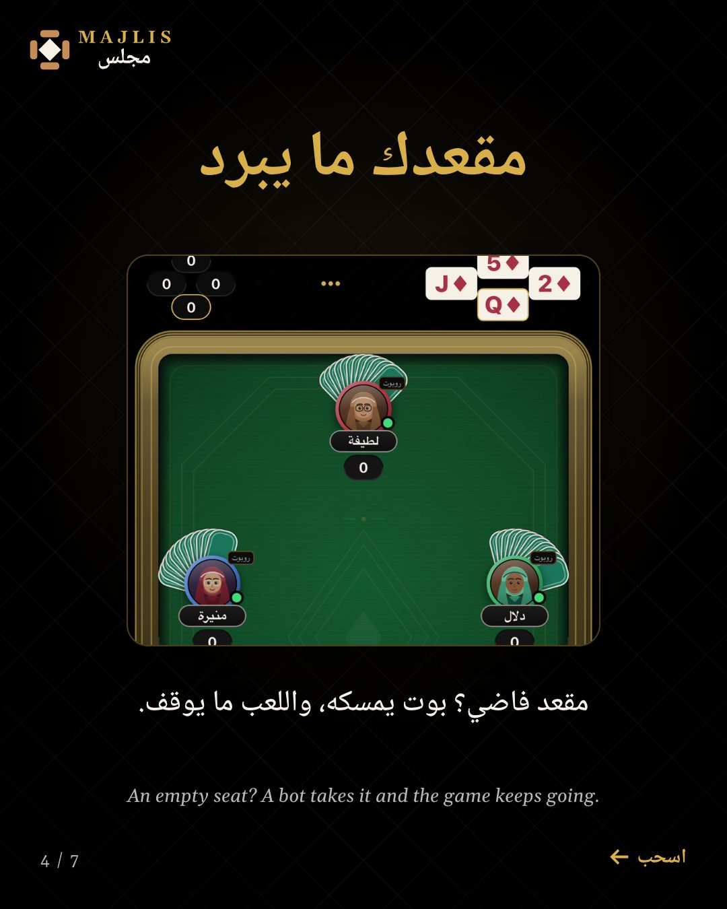
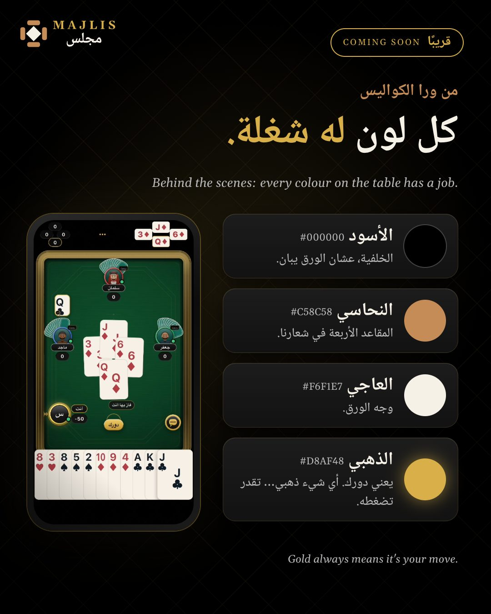

## Features

**At the table**
- **Three games, playable end to end:** Tarneeb (طرنيب), Trix (تركس) and 400 (أربعمية), with bidding, trump selection, Trix contracts and doubling.
- **Play your way:** a private table with friends (join code), a public table with new players, or solo against three bots.
- **Bots fill empty seats** so a game never waits, and a player who times out twice in a row is replaced by a bot until they return.
- **Offline play:** solo tables run entirely on the phone, with no network at all.
- **Turn speed** per table (fast, normal, slow) and a "back to your table" resume window if the app is closed mid-match.
- **A table that feels real:** a single fanned hand, drag or double-tap to play, card sounds, haptics, an Arabic voice announcer, and set-piece moments such as the King of Hearts shockwave.

**Social**
- **Friends** with handles, requests, and last-seen presence.
- **Table chat** with quick messages, emoji reactions, a profanity filter, and player reports with automatic hiding and escalating chat mutes.
- **Profile photos** (moderated through reports) and usernames.
- **Points and levels**, plus **weekly and all-time leaderboards**.

**Built for Arabic speakers first**
- Arabic right-to-left by default, with a full English mode; seat order and suit symbols are deliberately never mirrored.
- A bundled suit-glyph font so cards look the same on every Android and iOS device.
- A **skeuomorphic 2D design** in the Jawaker tradition: bevels, gloss, a felt with depth, buttons that look pressable, all drawn as flat 2D layers inside strict performance budgets.

## Architecture

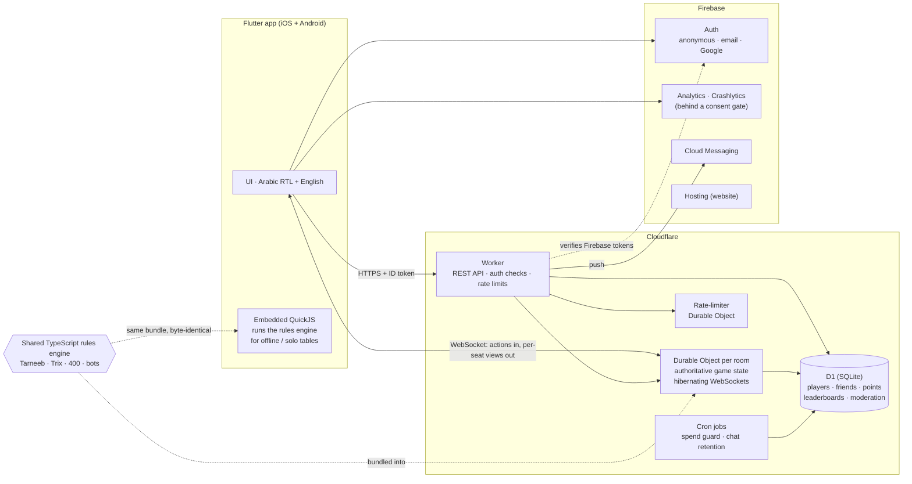
```mermaid
flowchart LR
  subgraph Phone["Flutter app (iOS + Android)"]
    UI["UI · Arabic RTL + English"]
    QJS["Embedded QuickJS<br/>runs the rules engine<br/>for offline / solo tables"]
  end

  subgraph CF["Cloudflare"]
    W["Worker<br/>REST API · auth checks · rate limits"]
    DO["Durable Object per room<br/>authoritative game state<br/>hibernating WebSockets"]
    RL["Rate-limiter<br/>Durable Object"]
    D1[("D1 (SQLite)<br/>players · friends · points<br/>leaderboards · moderation")]
    CRON["Cron jobs<br/>spend guard · chat retention"]
  end

  subgraph FB["Firebase"]
    AUTH["Auth<br/>anonymous · email · Google"]
    OBS["Analytics · Crashlytics<br/>(behind a consent gate)"]
    FCM["Cloud Messaging"]
    HOST["Hosting (website)"]
  end

  RULES{{"Shared TypeScript rules engine<br/>Tarneeb · Trix · 400 · bots"}}

  UI -- "HTTPS + ID token" --> W
  UI <-- "WebSocket: actions in, per-seat views out" --> DO
  W --> DO
  W --> RL
  W --> D1
  DO --> D1
  CRON --> D1
  W -- "push" --> FCM
  UI --> AUTH
  W -. "verifies Firebase tokens" .-> AUTH
  UI --> OBS
  RULES -. "bundled into" .-> DO
  RULES -. "same bundle, byte-identical" .-> QJS
```

**One rules engine, two runtimes.** The game rules are written once in pure TypeScript
and bundled into a single script. The server runs it to referee online tables; the
Flutter app runs the *same bundle* inside an embedded QuickJS engine for offline and
solo play. The app, the server and the downloadable bundle are checked to be
byte-identical, so a card is legal on the phone exactly when it is legal online.

## Engineering highlights

- **Server-authoritative play.** Clients only propose actions. Each room is a Durable
  Object that validates every move, and hidden hands never leave the server: every
  seat receives its own filtered view of the state.
- **Versioned rulesets.** Every rule change bumps a ruleset version, and a match keeps
  the rules it was dealt under, so a deploy never changes a game in progress.
- **Provable termination.** Round caps and a stall rule guarantee that every match
  ends, backed by property tests.
- **Cheap at rest.** Hibernating WebSockets, ping auto-responses that don't wake the
  room, one storage key per room, and "bot runs" that plan consecutive bot moves in a
  single write and let the app pace them.
- **Spend guard with automatic maintenance mode.** A scheduled job prices the month's
  cloud usage and, near a hard budget limit, closes new online play while matches in
  progress finish and offline play keeps working.
- **Abuse controls.** Rate limiting per user and per IP, a profanity filter,
  report-driven auto-hiding, and escalating chat mutes.
- **Privacy by default.** Analytics and crash reporting stay off until the player
  answers a consent prompt; accounts can be deleted from inside the app.
- **Portable by design.** Cloud-specific APIs sit behind thin seams, with a written
  plan to move the match server to a regional VM when scale calls for it.
- **Tested heavily:** about **3,260 automated tests** — 395 for the rules engine,
  644 for the server (run in the real Workers runtime), and 2,221 for the Flutter app —
  plus simulator integration tests that drive real matches.

## Tech stack

| Layer | Technology |
|---|---|
| Mobile app | Flutter, Dart, `flutter_js` (QuickJS), WebSockets, `audioplayers`, ARB localisation (Arabic + English) |
| Rules engine & bots | TypeScript, esbuild (single IIFE bundle), Vitest |
| Match server | Cloudflare Workers, Durable Objects (WebSocket hibernation, alarms), D1 (SQLite), cron triggers |
| Identity & messaging | Firebase Auth (anonymous, email, Google), Firebase Cloud Messaging |
| Observability | Firebase Analytics, Firebase Crashlytics (consent-gated) |
| Website | Static site on Firebase Hosting (Arabic + English, privacy policy, terms, account deletion) |
| Voice | Pre-rendered Arabic neural voice lines (Amazon Polly) |
| Tooling | Wrangler, Firebase CLI, Xcode + CocoaPods, Gradle, GitHub pull-request workflow |

## Status

**In development, pre-launch.** Tarneeb, Trix and 400 are playable end to end, online
and offline, on real Android phones and the iOS simulator; the match server and the
website are live. Majlis will launch on **Android and iOS together**. It is not in the
app stores yet.

Website: **https://majlis-game.com**

## About the developer

Majlis is designed, built and run by **Ahmad Balan**, a solo full-stack developer
based in Brazil: product and game design, the Flutter app, the TypeScript rules engine
and bots, the Cloudflare backend, DevOps and cost control, the website and the
marketing assets. Published by **AMB Ltd.**

---

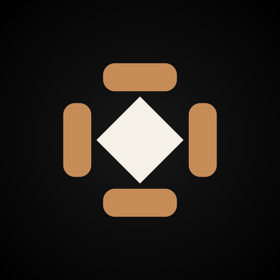 
Source code is private; this repository is a showcase. 
© 2026 AMB Ltd. All rights reserved. Majlis, مجلس and the Majlis logo are brands of AMB Ltd.

